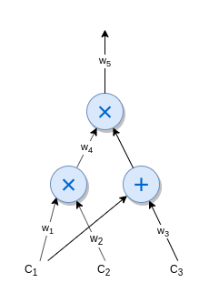
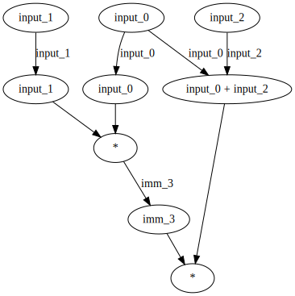

<p align="center">
<a href="https://www.adjoint.io">
  
</a>
</p>

[](https://circleci.com/gh/adjoint-io/arithmetic-circuits)

# Arithmetic Circuits

An *arithmetic circuit* is a low-level representation of a program that consists
of gates computing arithmetic operations of addition and multiplication, with
wires connecting the gates.

This form allows us to express arbitrarily complex programs with a set of
*private inputs* and *public inputs* whose execution can be publicly verified
without revealing the private inputs. This construction relies on recent
advances in zero-knowledge proving systems:

* Groth16 ([G16](https://eprint.iacr.org/2016/260.pdf))
* Groth-Maller ([GM17](https://eprint.iacr.org/2017/540.pdf))
* Pinnochio ([PGHR13](https://eprint.iacr.org/2013/279.pdf))
* Bulletproofs ([BBBPWM17](https://web.stanford.edu/~buenz/pubs/bulletproofs.pdf))
* Sonic ([MBKM19](https://eprint.iacr.org/2019/099))

This library presents a low-level interface for building zkSNARK proving systems
from higher-level compilers. This system depends on the following cryptographic
dependenices.

* [pairing](https://www.github.com/adjoint-io/pairing) - Optimised bilinear
  pairings over elliptic curves
* [galois-field](https://www.github.com/adjoint-io/galois-field) - Finite field
  arithmetic
* [galois-fft](https://www.github.com/adjoint-io/galois-fft) - Finite field
  polynomial arithmetic based on fast Fourier transforms
* [elliptic-curve](https://www.github.com/adjoint-io/elliptic-curve) - Elliptic
  curve operations
* [bulletproofs](https://www.github.com/adjoint-io/bulletproofs) - Bulletproofs
  proof system
* [arithmoi](https://www.github.com/adjoint-io/arithmoi) - Number theory
  operations
* [semirings](https://www.github.com/adjoint-io/semirings) - Algebraic semirings
* [poly](https://www.github.com/adjoint-io/poly) - Efficient polynomial
  arithmetic

## Theory

### Towers of Finite Fields

This library can build proof systems polymorphically over a variety of pairing
friendly curves. By default we use the [BN254](https://github.com/adjoint-io/elliptic-curve/blob/master/src/Data/Curve/Weierstrass/BN254.hs)
with an efficient implementation of the optimal Ate pairing.

The Barreto-Naehrig (BN) family of curves achieve high security and efficiency
with pairings due to an optimum embedding degree and high 2-adicity. We have
implemented the optimal Ate pairing over the BN254 curve we define $q$ and $r$
as:

* $q = 36t^4 + 36t^3 + 24t^2 + 6t + 1$
* $r = 36t^4 + 36t^3 + 18t^2 + 6t + 1$
* $t = 4965661367192848881$

The tower of finite fields we work with is defined as:

* $\mathbb{F}_{q^2} = \mathbb{F}_q[u]/u^2 + 1$
* $\mathbb{F}_{q^6} = \mathbb{F}_{q^2}[v]/v^3 - (9 + u)$
* $\mathbb{F}_{q^{12}} = \mathbb{F}_{q^6}[w]/w^2 - v$

### Arithmetic circuits

<p align="center">

</p>

An arithmetic circuit over a finite field is a directed acyclic graph with gates
as vertices and wires and edges. It consists of a list of multiplication gates
together with a set of linear consistency equations relating the inputs and
outputs of the gates.

Let $\mathbb{F}$ be a finite field and $C: \mathbb{F}^n \times \mathbb{F}^h \rightarrow \mathbb{F}^l$ a map that takes $n+h$
arguments as inputs from $\mathbb{F}$ and outputs l elements in $\mathbb{F}$. The function C is an arithmetic circuit if the
value of the inputs that pass through wires to gates are only manipulated according to arithmetic operations + or x (allowing
constant gates).

Let $n$, $h$, $l$ respectively denote the input, witness and output size and
$N = (n+h)+l$ be the number of all inputs and outputs of the circuit
A tuple $(a_1, ..., a_N) \in \mathbb{F}^N$, is said to be a valid
assignment for an arithmetic circuit C if $C(a_1,...,a_{n+h}) = (a_{n+h+1}, ..., a_N)$.


### Quadratic Arithmetic Programs (QAP)

QAPs are encodings of arithmetic circuits that allow the prover to construct a
proof of knowledge of a valid assignment $(a_1,...,a_N) \in \mathbb{F}^N$ for a given
circuit $C$.

A quadratic arithmetic program (QAP) $Q(C)$ contains three sets of polynomials in
$\mathbb{F}[x]$:

$$
A=\{A_k(x) : k \in \{0..m\}\}$, $B=\{B_k(x) : k \in \{0..m\}\}$, $C=\{C_k(x) : k \in \{0..m\}\}$
$$

and a target polynomial $T(x)$.

In this setting, an assignment $(a_1,...,a_N)$ is valid for a circuit $C$ if and
only if the target polynomial $T(x)$ divides the polynomial:

$$
P(x) = (A_0(x) + \sum_{k=1}^m a_k A_k(x)) (B_0(x) + \sum_{k=1}^m a_k B_k(x)) - (C_0(x) + \sum_{k=1}^m a_k C_k(x))$
$$

Logical circuits can be written in terms of the addition, multiplication and
negation operations.

* $\text{AND}(a,b) = ab$
* $\text{NOT}(a) = 1 - a$
* $\text{NAND}(a,b) = 1 - ab$
* $\text{NOR}(a,b) = 1 - (1 - a)(1 - b)$
* $\text{XOR}(a,b) = (a+b) - 2ab$

## DSL and Circuit Builder Monad

Any arithmetic circuit can be built using a domain specific language to
construct circuits that lives inside [Lang.hs](src/Circuit/Lang.hs).

```haskell ignore
type ExprM f a = State (ArithCircuit f, Int) a
execCircuitBuilder :: ExprM f a -> ArithCircuit f
```

```haskell ignore
-- | Binary arithmetic operations
add, sub, mul :: Expr Wire f f -> Expr Wire f f -> Expr Wire f f
```

```haskell ignore
-- | Binary logic operations
-- Have to use underscore or similar to avoid shadowing @and@ and @or@
-- from Prelude/Protolude.
and_, or_, xor_ :: Expr Wire f Bool -> Expr Wire f Bool -> Expr Wire f Bool
```

```haskell ignore
-- | Negate expression
not_ :: Expr Wire f Bool -> Expr Wire f Bool
```

```haskell ignore
-- | Compare two expressions
eq :: Expr Wire f f -> Expr Wire f f -> Expr Wire f Bool
```

```haskell ignore
-- | Convert wire to expression
deref :: Wire -> Expr Wire f f
```

```haskell ignore
-- | Return compilation of expression into an intermediate wire
e :: Num f => Expr Wire f f -> ExprM f Wire
```

```haskell ignore
-- | Conditional statement on expressions
cond :: Expr Wire f Bool -> Expr Wire f ty -> Expr Wire f ty -> Expr Wire f ty
```

```haskell ignore
-- | Return compilation of expression into an output wire
ret :: Num f => Expr Wire f f -> ExprM f Wire
```

The following program represents the image of the
arithmetic circuit [above](#arithmetic-circuits-1).

```haskell ignore
program :: ArithCircuit Fr
program = execCircuitBuilder (do
  i0 <- fmap deref input
  i1 <- fmap deref input
  i2 <- fmap deref input
  let r0 = mul i0 i1
      r1 = mul r0 (add i0 i2)
  ret r1)
```

The output of an arithmetic circuit can be converted to a DOT graph and save it
as SVG.

```haskell ignore
dotOutput :: Text
dotOutput = arithCircuitToDot (execCircuitBuilder program)
```

<p>
  
</p>


## Example

We'll keep taking the program constructed with our DSL as example and will
use the library [pairing](https://www.github.com/adjoint-io/pairing) that
provides a field of points of the BN254 curve and precomputes primitive roots of
unity for binary powers that divide $r - 1$.

```haskell
import Protolude

import qualified Data.Map as Map
import Data.Pairing.BN254 (Fr, getRootOfUnity)

import Circuit.Arithmetic
import Circuit.Expr
import Circuit.Lang
import Fresh (evalFresh, fresh)
import QAP

program :: ArithCircuit Fr
program = execCircuitBuilder (do
  i0 <- fmap deref input
  i1 <- fmap deref input
  i2 <- fmap deref input
  let r0 = mul i0 i1
      r1 = mul r0 (add i0 i2)
  ret r1)
```

We need to generate the roots of the circuit to construct polynomials $T(x)$ and
$P(x)$ that satisfy the divisibility property and encode the circuit to a QAP to
allow the prover to construct a proof of a valid assignment.

We also need to give values to the three input wires to this arithmetic circuit.

```haskell
roots :: [[Fr]]
roots = evalFresh (generateRoots (fmap (fromIntegral . (+ 1)) fresh) program)

qap :: QAP Fr
qap = arithCircuitToQAPFFT getRootOfUnity roots program

inputs :: Map.Map Int Fr
inputs = Map.fromList [(0, 7), (1, 5), (2, 4)]
```

A prover can now generate a valid assignment.

```haskell
assignment :: QapSet Fr
assignment = generateAssignment program inputs
```

The verifier can check the divisibility property of $P(x)$ by $T(x)$ for the given circuit.

```haskell
main :: IO ()
main = do
  if verifyAssignment qap assignment
    then putText "Valid assignment"
    else putText "Invalid assignment"
```

See [Example.hs](./Example.hs).

## Disclaimer

This is experimental code meant for research-grade projects only. Please do not
use this code in production until it has matured significantly.

## License

```
Copyright (c) 2017-2020 Adjoint Inc.

Permission is hereby granted, free of charge, to any person obtaining a copy
of this software and associated documentation files (the "Software"), to deal
in the Software without restriction, including without limitation the rights
to use, copy, modify, merge, publish, distribute, sublicense, and/or sell
copies of the Software, and to permit persons to whom the Software is
furnished to do so, subject to the following conditions:

The above copyright notice and this permission notice shall be included in all
copies or substantial portions of the Software.

THE SOFTWARE IS PROVIDED "AS IS", WITHOUT WARRANTY OF ANY KIND,
EXPRESS OR IMPLIED, INCLUDING BUT NOT LIMITED TO THE WARRANTIES OF
MERCHANTABILITY, FITNESS FOR A PARTICULAR PURPOSE AND NONINFRINGEMENT.
IN NO EVENT SHALL THE AUTHORS OR COPYRIGHT HOLDERS BE LIABLE FOR ANY CLAIM,
DAMAGES OR OTHER LIABILITY, WHETHER IN AN ACTION OF CONTRACT, TORT OR
OTHERWISE, ARISING FROM, OUT OF OR IN CONNECTION WITH THE SOFTWARE OR THE USE
OR OTHER DEALINGS IN THE SOFTWARE.
```
